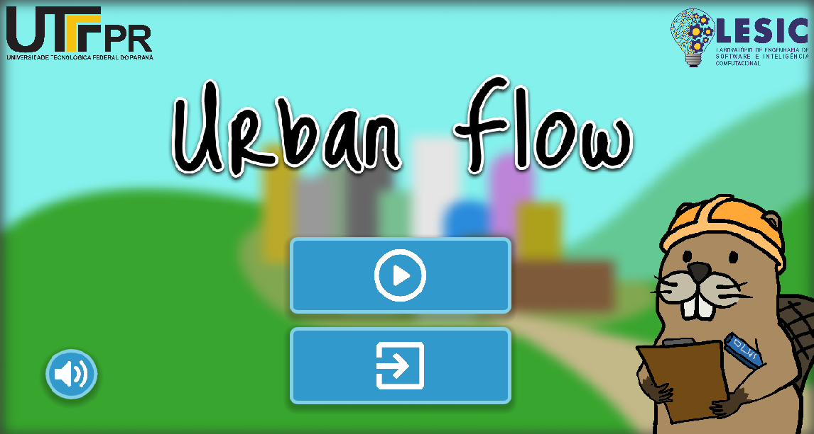
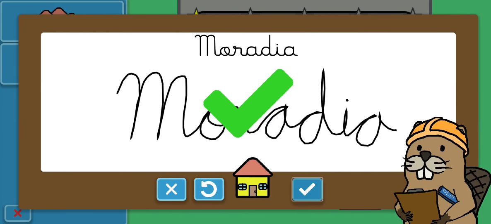
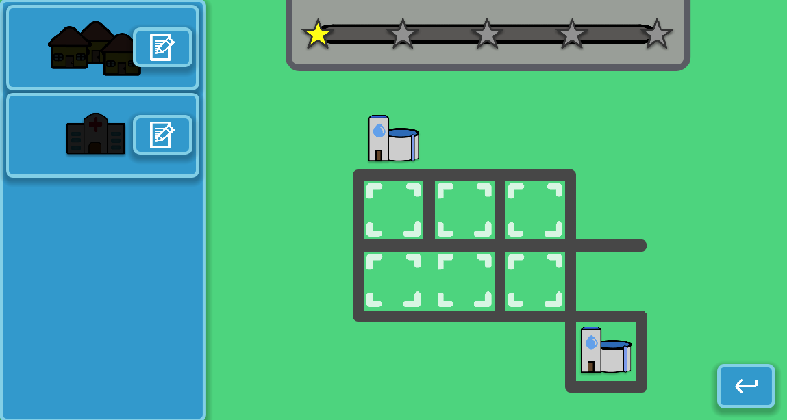
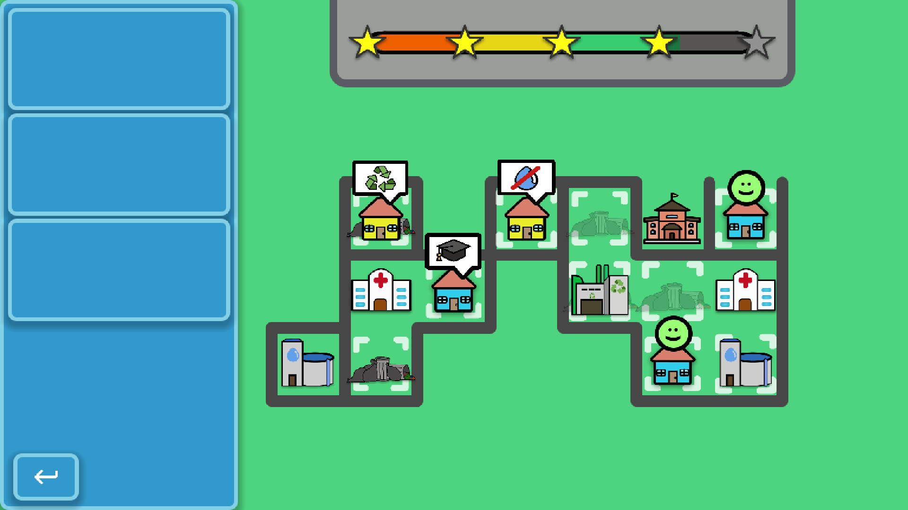

# Urban Flow

A Godot 4.5 educational game for children that serves as the data-collection
instrument for an undergraduate research project. Players build
a small city by placing service buildings on a grid; to unlock each building
they must handwrite its Portuguese name on a digital whiteboard. A TensorFlow
Lite CNN running inside Godot recognizes the handwriting in real time. Every
session is stored locally in a SQLite database for later research analysis.

## Screenshots

| | |
|---|---|
|  |  |
| **Main menu** – title screen with play and settings buttons | **Blackboard** – player handwrites "Moradia"; the CNN recognises it and shows a green checkmark |
|  |  |
| **Level 2** – early stage; one sanitation building placed, catalog showing unlocked buildings on the left | **Level 11** – advanced stage; large city grid nearly full, 4-star score in progress |

## Research context

The game is the artifact studied in the paper that motivated this repository.
The research investigates children's handwriting recognition in mobile
educational games and collects:

- **Interaction telemetry** – clicks, drag-and-drop events, scene visit times.
- **Handwriting samples** – each word the player draws, stored as a PNG image
  alongside the model's raw per-class confidence scores.
- **Session metadata** – anonymous device ID, age (birthday), and gender,
  collected after an explicit informed-consent flow on first launch.

No data leaves the device automatically; the `.db` file is retrieved manually
from the device for analysis.

## Game overview

| Aspect | Detail |
|---|---|
| Engine | Godot 4.5.1, GL Compatibility renderer |
| Target platform | Android (arm64); Linux desktop for development |
| Viewport | 1280 × 720, canvas-item stretch |
| Levels | 12, unlocked sequentially |
| Max FPS | 30 |

### Flow

1. **Consent form** – displayed on the very first launch; declining quits the
   app and discards the session.
2. **Profile forms** – gender and birthday collected once per installation.
3. **Level selector** – shows locked/unlocked levels.
4. **Level** – an isometric-ish tile grid. A sidebar catalog lists available
   buildings. Tapping a building opens the **blackboard**.
5. **Blackboard** – player draws the building's Portuguese name on a whiteboard.
   The CNN checks the drawing; if confidence ≥ threshold the building is
   unlocked and can be dragged onto the grid. After two failed attempts the
   word appears as a ghost hint behind the whiteboard.
6. **Score / star rating** – each placed building contributes to a score based
   on proximity to existing buildings; the level ends when the max score is
   reached.

### Building types

| Kind | Portuguese word |
|---|---|
| House | Moradia |
| Hospital | Hospital |
| Recycling | Reciclagem |
| Water/sanitation | Saneamento |
| School | Escola |

## Architecture

```
urban-flow/
├── global/
│   ├── global.gd         # Autoload: paths, volume, aspect-ratio logic
│   ├── game_state.gd     # Autoload: current level + placed buildings
│   ├── player_info.gd    # Autoload: SQLite telemetry (sessions, scenes,
│   │                     #   interactions, handwriting blobs)
│   ├── signals.gd        # Autoload: cross-scene signals
│   └── audio_manager.gd  # Autoload: sound effects
├── scenes/
│   ├── main_menu/        # Consent / gender / birthday forms → play button
│   ├── selection/        # Level selector grid
│   ├── level/
│   │   ├── level.tscn    # Root scene; wires Catalog → Grid → Tutorial
│   │   ├── ui/
│   │   │   ├── blackboard/
│   │   │   │   ├── blackboard.gd    # Orchestrates drawing → CNN → unlock
│   │   │   │   ├── white_board.gd   # Freehand drawing surface + rasterizer
│   │   │   │   └── cnn_prediction/  # TFLitePredictor wrapper + preprocessing
│   │   │   ├── catalog/             # Building sidebar
│   │   │   ├── tutorial/            # Per-level hint overlays
│   │   │   └── win/                 # Completion screens
│   │   └── world/                   # TileMap grid + camera
│   └── settings/
├── levels/1…12/          # LevelData resources + layout scenes
├── buildings/            # BuildingData resources (word, sprite, score, threshold)
├── model/
│   └── model.tflite      # MobileNetV2-based handwriting CNN (not in git)
└── addons/
    ├── tflite_gdext/     # Custom GDExtension: TFLitePredictor node
    └── godot-sqlite/     # SQLite GDExtension
```

### Handwriting pipeline

1. `WhiteBoard` captures mouse/touch strokes and rasterizes them to an `Image`
   on confirm.
2. `WhiteBoard.trim_with_padding()` crops white borders and adds a small margin.
3. `CnnPrediction._image_to_model_input()` resizes to 324 × 324, converts to
   BGR, and applies MobileNetV2's `preprocess_input` (scale to `[−1, 1]`).
4. `TFLitePredictor.predict()` (from `tflite_gdext`) runs inference and returns
   a `PackedFloat32Array` of per-class softmax scores.
5. The score for the expected class is compared to `BuildingData.confidence_threshold`
   (default 0.7). Pass → building unlocked; fail → player retries (hint shown
   after 2 fails).

### Telemetry schema (SQLite)

| Table | Key columns |
|---|---|
| `sessions` | `session_id` (UUIDv4), `device_id`, `gender`, `birth_*`, `total_duration`, `dirty` |
| `scenes` | `session_id`, `scene`, `time`, `duration` |
| `interactions` | `session_id`, `type` (click/drag), coordinates, `clicked`, `drag`, `drop_target`, `level` |
| `writings` | `session_id`, `kind` (building type), `image` (PNG blob), `prediction_json` |

Sessions that never produce a writing (e.g. player opens app and closes
immediately) are discarded on exit to avoid polluting the dataset.

## Dev setup

The repo includes a Nix flake that provides a reproducible shell with Godot
4.5.1, the Android SDK/NDK, and Java 17.

```sh
nix develop        # enter the dev shell
godot --editor .   # open the editor (run from repo root)
```

One-time Godot editor setup (only needed after a clean Nix store):

> **Editor Settings → Export → Android**
> - Android SDK Path: `~/.cache/urban-flow-toolchain/android-sdk`
> - Java SDK Path: `~/.cache/urban-flow-toolchain/jdk`

These are stable symlinks maintained by the flake's `shellHook`, so they
survive Nix store GC without needing to be changed again.

### GDExtension binaries (not in git)

The `.so` files for `tflite_gdext` and `libtensorflowlite_c` are large
compiled binaries excluded from version control. See
`addons/tflite_gdext/README.md` for build instructions. Pre-built copies
must be placed there before the game can run with handwriting recognition.

The `model.tflite` file is similarly excluded and must be placed at
`model/model.tflite`.

## Android export

```sh
# From inside nix develop:
godot --headless --export-debug "Android" urban-flow.apk
```

The APK is signed with a debug keystore. The `android/libtensorflowlite_c.so`
file inside `addons/tflite_gdext/` must be the **Android arm64 build** of the
TFLite C library named exactly `libtensorflowlite_c.so`; the dynamic linker
resolves it by filename inside the APK's `lib/arm64-v8a/` directory.

## Data retrieval

After a playtest session, pull the SQLite database from the device:

```sh
adb pull /data/data/br.edu.utfpr.<package>/files/player_info.db ./player_info.db
sqlite3 player_info.db
```

The `writings.image` column contains raw PNG bytes; the `writings.prediction_json`
column contains the model's full per-class confidence map for each drawing.
